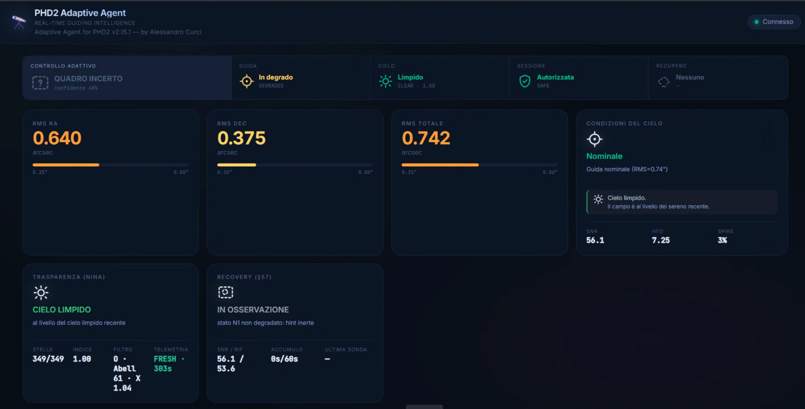
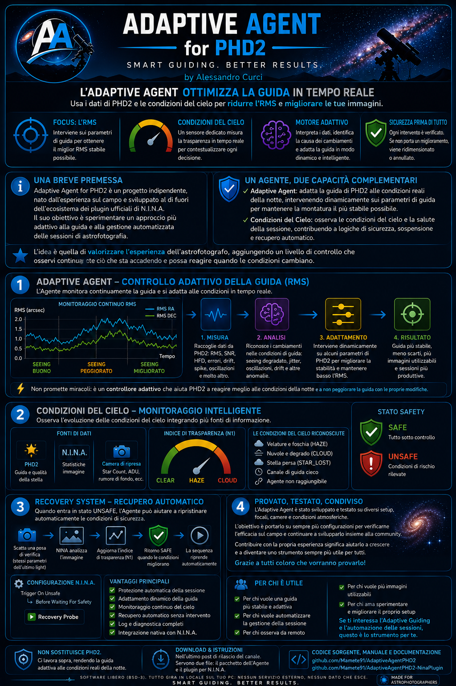
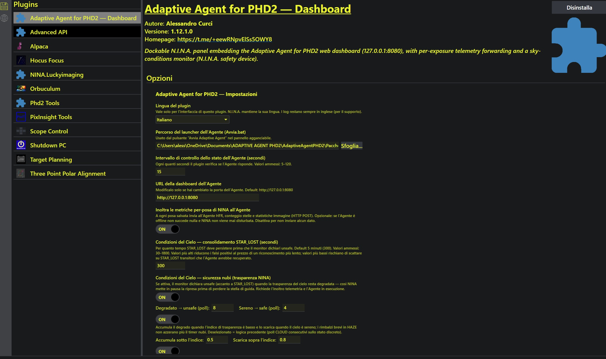
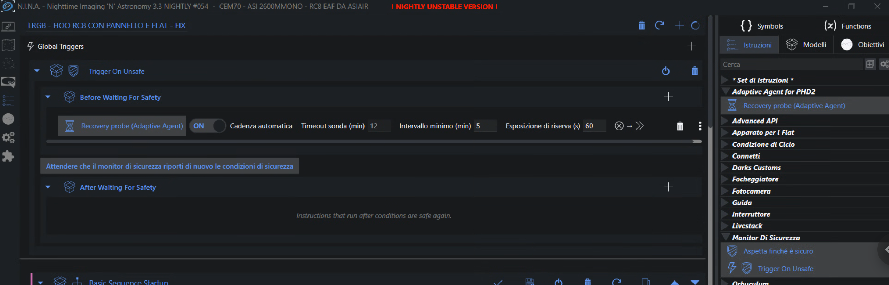

# 🔭 Adaptive Agent for PHD2

**Adaptive tuning for PHD2 autoguiding, driven by measured outcomes.**

Version **2.15.1** · N.I.N.A. plugin **1.12.2.0** · License **BSD-3-Clause** · Windows · Python 3.11+



<sub>A real session on **Abell 61**: guiding at 0.74″ total, clear sky, 349 of 349 reference
stars. The five slots across the top — adaptive control, guiding, sky, session, recovery —
are the whole state of the system at a glance; every number and its provenance is one hover
away.</sub>

---

## The problem

PHD2 is an excellent autoguider, but it optimizes the *single correction pulse*: it reacts frame by frame to keep the star centered, with **fixed, user-set parameters**. Sky conditions are not fixed — seeing, transparency and target altitude drift over a night — so parameters tuned at dusk may be wrong by midnight. What PHD2 does not do: adapt its own parameters as conditions change, distinguish *why* guiding degrades (seeing vs. drift vs. over-correction), use external context such as clouds, or verify whether a parameter change actually **improved the result**.

## The approach: an Outcome-First outer loop

The **Adaptive Agent** runs alongside PHD2 as an outer control loop. It observes guiding over minutes, maintains a continuously measured RMS **baseline**, and adjusts **only two PHD2 guide-algorithm parameters: Aggressiveness and MinMove**. The defining rule of its **Outcome-First controller**: after every adjustment the Agent **measures the outcome** — an adjustment is kept only if guiding RMS holds or improves, and is reverted otherwise.

This is **adaptive control, not machine learning**: no training, no black box. Every decision is inspectable in the logs and on the live dashboard.

<p align="center">
  
</p>

<sub><i>The whole project in one picture (Italian): what the engine reads, how it decides, how
the two degradation paths differ, and how a clouded-out session recovers on its own.</i></sub>

```
      ┌────────────── context & safety ────────────────┐
      │                                                │
   N.I.N.A. ──exposure telemetry──▶  ADAPTIVE AGENT  ◀──guide events── PHD2
   (plugin) ◀───────UNSAFE────────  observe · evaluate ──Aggr/MinMove──▶
                                    · adapt the levers   (guide star)
                                          │
                                          ▼
                                 dashboard (live observability)
```

Key elements of the adaptive guiding engine:

- **Continuous bidirectional RMS baseline** — the reference the outcome is measured against, updated throughout the session.
- **Initialization to PHD2 standard values** — levers start from PHD2's own defaults (algorithm-aware), which also serve as the anchor.
- **Adaptive MinMove cap** — MinMove can never be pushed above a ceiling derived from the measured baseline and the imaging scale.
- **Symmetric outcome-guided recovery** — after softening under bad seeing, the engine stiffens back toward the standard values as soon as the measured outcome proves it safe.
- **GUARDIAN mode** — the supervision layer that watches for degradation and drives recovery. It is the official operating mode; `off` is supported for A/B comparison against plain PHD2.
- **Kill-switches everywhere** — every engine intervention sits behind its own configuration flag.

## Safety by design

- Talks to PHD2 **only through PHD2's public server API** (JSON-RPC over TCP, as documented by the PHD2 project).
- Modifies **only Aggressiveness and MinMove** — never mount, calibration, dithering or backlash settings.
- **Saves the user's parameters at startup and restores them** at shutdown — including recovery after a crash (Baseline Guardian).
- **DRY_RUN mode**: full decision pipeline, zero commands sent — recommended for the first night on any new setup.
- **Local only**: PHD2 connection and dashboard live on `localhost`; the Agent contacts **no external services**.
- Every action is rate-limited (cooldown), bounded (guardrails) and logged with its cause.

## N.I.N.A. integration (optional)

A companion plugin — **[Adaptive Agent for PHD2 — Dashboard](https://github.com/Mamete91/AdaptiveAgentPHD2-NinaPlugin)** — integrates the Agent into [N.I.N.A.](https://nighttime-imaging.eu/). Its centerpiece is a virtual **Sky Conditions monitor** (exposed through N.I.N.A.'s native `ISafetyMonitor` interface — the same role an ASCOM safety monitor plays): one continuously evaluated **SAFE/UNSAFE verdict on acquisition quality**, built from six independent conditions: sustained STAR_LOST; persistent N1 sky-transparency degradation measured on the imaging camera; a sustained collapse of the guide-star signal, which the guide channel sees minutes before the next light frame could; stale telemetry under an already degraded sky; loss of the Agent during an active session; and a guide channel gone silent while guiding was expected. Fast evidence and persistent evidence carry independent thresholds, and recovery toward safe is granted only by the imaging camera — one guide star can testify that the sky went bad, never that the whole field came back. It never fails *toward* safe. **N.I.N.A.'s Sequence Engine always remains the sole owner of the sequence lifecycle**: the monitor only reports, and the user's end-of-sequence criteria always win (verified down to N.I.N.A.'s cancellation chain). On top of that state the plugin ships the recommended recovery workflow — the self-contained **Recovery probe** instruction for *Trigger On Unsafe*, which lets a clouded-out session resume on its own — plus the dockable dashboard panel, per-exposure **N.I.N.A. telemetry** forwarding (HFR, star count, image statistics — what the Agent uses to recognize sky transparency), a bounded **meridian-protection window** that lets the mechanical flip run at its deadline even under unsafe conditions and then restores the hold — without it N.I.N.A. stops tracking at the deadline and nothing ever restarts it — and **Agent lifecycle management**: auto-launch when N.I.N.A. starts and graceful shutdown (with PHD2 baseline restore) when it closes. The Agent is fully functional without it.



<sub>The plugin page in N.I.N.A.'s Plugin Manager. Every safety condition sits behind its own
switch, each with the reasoning behind its default written next to it — the settings explain
themselves, so nothing has to be taken on trust.</sub>

**The whole unattended-recovery setup is one instruction, and what matters is where it goes:**



<sub>`Trigger On Unsafe` → `Before Waiting For Safety` → **Recovery probe (Adaptive Agent)**.
Nested there, the probe runs *before* N.I.N.A. parks itself on the safety wait: while conditions
are unsafe it takes verification exposures replicating the interrupted light, and the moment the
monitor returns SAFE the wait ends and the sequence resumes on its own. No extra containers, no
Camera instructions — and *After Waiting For Safety* stays free for anything you want to run on
the way back.</sub>

## Quick start

**Requirements:** PHD2 2.6.x with **Tools → Enable Server** activated. The packaged build carries its own runtime — no Python needed; from source you need Python 3.11+.

### With N.I.N.A. — recommended, and nothing to start by hand

Two downloads: the **Agent** package and the **N.I.N.A. plugin**. You need both.

1. **Install the plugin.** Extract the plugin ZIP into `%LOCALAPPDATA%\NINA\Plugins\3.0.0`, then restart N.I.N.A.
2. **Install the Agent.** Extract the Agent ZIP into any folder you like.
3. **Tell N.I.N.A. where the Agent is.** Open the plugin settings, find *Agent launcher path (Avvia.bat)* and use **Browse…** to select the `Avvia.bat` inside the folder you just extracted.
4. **Connect the device.** Under *Equipment → Safety Monitor*, pick **Adaptive Agent for PHD2 — Sky Conditions** and connect it.
5. **Start.** With the path set, the Agent launches by itself the next time N.I.N.A. starts. To start it right now, the *Launch Adaptive Agent* button in the panel does the same thing.
6. **Check.** The dashboard should show **Connected**; once guiding is running, PHD2 data and sky monitoring start flowing in.

That is the whole setup — from then on the Agent starts with N.I.N.A. and **shuts down gracefully when N.I.N.A. closes**, restoring your PHD2 parameters. You never touch a `.bat` again. For unattended cloud recovery, add the **Recovery probe** instruction inside a *Trigger On Unsafe* (see the section above).

> **Upgrading?** The launcher path points at the *old* version's folder. After extracting a new Agent build, go back to step 3 and re-select `Avvia.bat` in the new folder.

### Standalone — without N.I.N.A.

1. Open PHD2, select your telescope profile, enable the server and start guiding.
2. Run **`Avvia.bat`** from the distribution package — the Agent starts **in the background** (no console window).
3. Open the dashboard at `http://localhost:8080`.

Stop it gracefully — PHD2 parameters restored — with **`Arresta.bat`**; watch the live log with **`Mostra_Log.bat`** (it also persists in `logs/agent.log`).

Switching telescopes = switching PHD2 profiles: the Agent reads the guide pixel scale from PHD2 and derives its RMS thresholds from a measured baseline. **No per-setup configuration files.**

### From source

```powershell
git clone https://github.com/Mamete91/AdaptiveAgentPHD2.git
cd AdaptiveAgentPHD2
python -m pip install -r requirements.txt

python main.py --monitor-only      # observe only, zero control
python main.py --simulator --dry-run   # no hardware needed
python main.py --dry-run           # real PHD2, decisions logged, nothing sent
python main.py --config config.toml    # live control
```

## Observability

- **Dashboard** (`http://localhost:8080`) — built to be read in two seconds, not decoded. Five fixed slots across the top say what is happening (adaptive control, guiding, sky, session, recovery); contextual icons appear underneath only when something is actually intervening; the numbers and their provenance live in the tooltips. Underneath it all the detailed panels are unchanged: live chart, RMS gauges, engine state, decision log, transparency and MinMove-cap.
- **Session logs** in `logs/`: per-frame CSV, per-decision JSONL, session summary JSON, plus the rotating `agent.log` — every decision can be audited offline.

## Validation philosophy

The project is validated **primarily in real astrophotography sessions**, not only synthetic tests. New engine features ship behind kill-switches and are promoted only after field nights; the unit-test suite (389 tests, plus 73 on the N.I.N.A. plugin) guards regressions. The first night on a new setup always runs in DRY_RUN.

## Documentation

- **[`ARCHITETTURA_MOTORE.md`](ARCHITETTURA_MOTORE.md)** — system architecture (bilingual, Italian/English): layered engine design, PHD2 ↔ Agent ↔ N.I.N.A. data flow, safety model, validation status.
- **[`STUDIO_PHD2_DESIGN.md`](STUDIO_PHD2_DESIGN.md)** — technical design study of PHD2's guiding control (Italian).
- **[`CHANGELOG.md`](CHANGELOG.md)** — release history.
- **[`CONTRIBUTING.md`](CONTRIBUTING.md)** — how to field-test and contribute.
- **[User manual (PDF)](doc/Manuale_Utente_Agent.pdf)** — step-by-step operational guide (Italian).
- **[`docs/development/`](docs/development/)** — the complete development history (Italian): technical changelog, design notes, implementation prompts. Kept public for full traceability.

## Community & support

Official community and beta-testing group (Telegram): https://t.me/+eewRNpvElSs5OWY8

## License

**BSD-3-Clause** — see [`LICENSE`](LICENSE). Copyright (c) 2026 Alessandro Curci.

PHD2 is a project of the [OpenPHDGuiding](https://openphdguiding.org/) team; N.I.N.A. is a project of the [N.I.N.A. team](https://nighttime-imaging.eu/). This project is independent from both.
